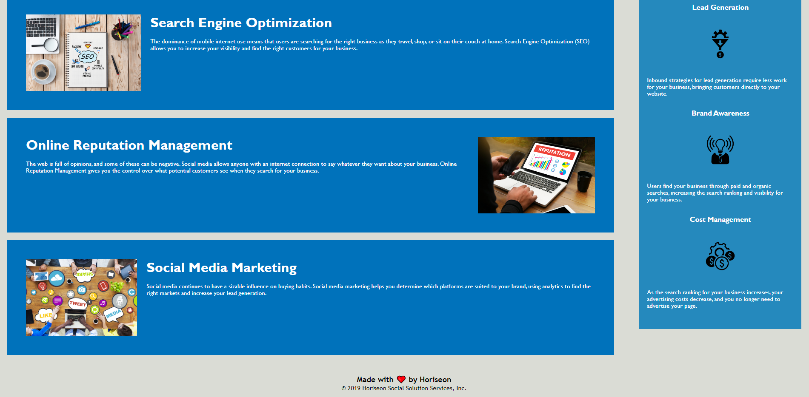

# Horiseon Refactor

## Description here

- My motivation for this project was to apply the knowledge given to me in a class setting and be able to apply that knowledge in order to not only get the practice, but to consistently create websites that are easy to use and navigate for all types of people.
- I built this project to better understand and apply accessibility standards for HTML.
- This code has alternate text on images in order to assist those who benefit from accessibility friendly websites.
- Refactoring this code helped me learn how to clearly and concisely add alternate text for images.

## Usage

    

    

## Credits

I used the ReadMe guide from [https://coding-boot-camp.github.io/full-stack/github/professional-readme-guide](https://coding-boot-camp.github.io/full-stack/github/professional-readme-guide).
